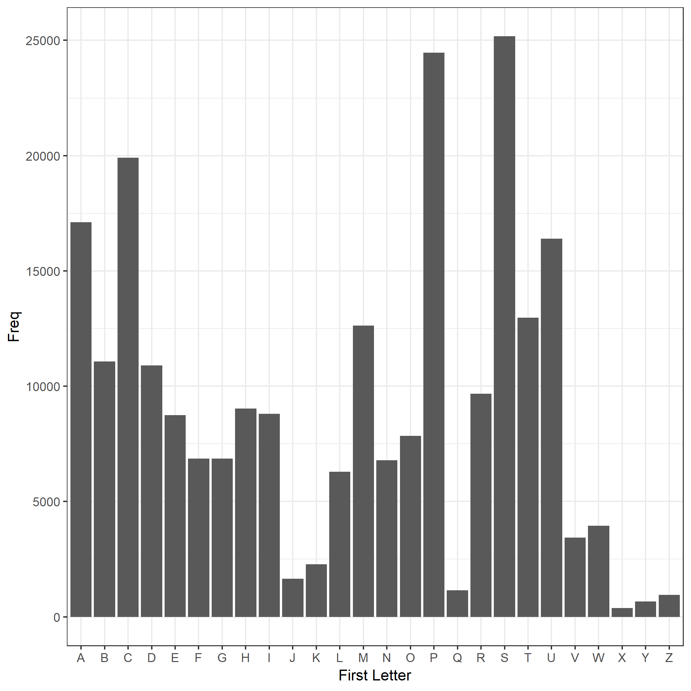

```r
bar_data <- read.delim("bar_firstletter.tsv")
```

I looked at each word in the dictionary (`words.txt`) and looked at the first letter. Then I tallied the freqency of each first letter.


```r
knitr::kable(bar_data)
```


first_letter     Freq
-------------  ------
A               17104
B               11077
C               19908
D               10900
E                8738
F                6865
G                6862
H                9033
I                8800
J                1643
K                2284
L                6290
M               12621
N                6784
O                7850
P               24462
Q                1152
R                9676
S               25170
T               12969
U               16390
V                3440
W                3947
X                 385
Y                 671
Z                 949


```r
most_freq <- with(bar_data, first_letter[which.max(Freq)])
```

The most frequent word length is "S".

Here is a histogram of word lengths.


