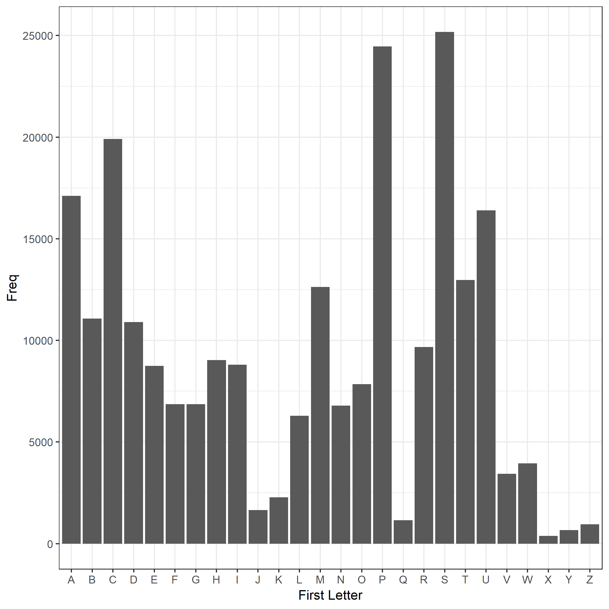

```{r load data}
bar_data <- read.delim("bar_firstletter.tsv")
```

I looked at each word in the dictionary (`words.txt`) and looked at the first letter. Then I tallied the freqency of each first letter.

```{r}
knitr::kable(bar_data)
```

```{r}
most_freq <- with(bar_data, first_letter[which.max(Freq)])
```

The most frequent word length is "`r most_freq`".

Here is a histogram of word lengths.


